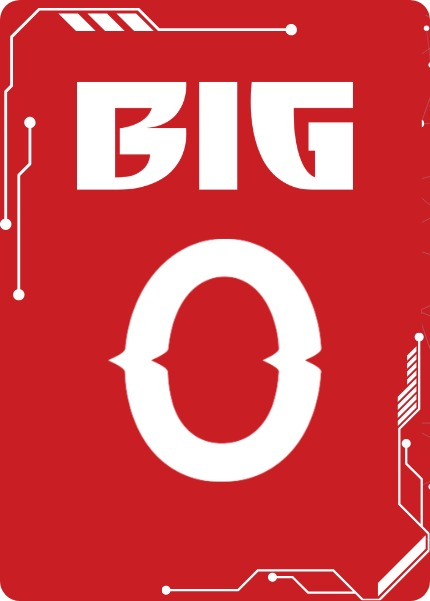

# API 2° SEMESTRE ADS

  
  <h2 align="center"> Equipe Big O</h2>

  <a href ="#equipe"> Equipe</a>  |
  <a href ="#backlog"> Product Backlog</a>  |
  <a href ="#desafio"> Desafio</a>  |
  <a href ="#solução"> Solução</a>  |
  <a href ="#dor">DoR</a>  |
  <a href ="#dod">DoD</a>  |
  <a href ="#sprint"> Cronograma de Sprints</a>  |

---

  # LandingPage de Captação e Pré Qualificação de Clientes

## Desafio🏅 
Desenvolver uma landing page de captação com experiência simples e intuitiva para o usuário, garantindo que todas as regras de aprovação, reprovação e seleção de loja sejam aplicadas corretamente conforme o tipo de cliente e cartão solicitado.

A aplicação deve verificar se o cliente é pré-qualificado nas bases da DM para encaminhar o processo, cobrindo três produtos: Cartão DM (bandeirado), Cartão Loja (física, restrita ao estado do cliente) e Cartão Loja Digital (sem restrição geográfica, sem emissão física).

## Solução🏅 
A solução consiste no desenvolvimento de uma landing page web para captação e pré-qualificação de clientes da DM (antiga DMcards), construída em Python com banco de dados relacional MySQL.

O sistema recebe os dados pessoais e o CEP do cliente, identifica automaticamente se ele é colaborador DM ou não, e aplica as regras de negócio para retornar um status de aprovado, reprovado ou em análise. Para solicitações de Cartão Loja, o sistema também valida a disponibilidade de lojas parceiras no estado informado antes de concluir a proposta (PAC).

---

# Product Backlog📋 
| Rank  | Prioridade |                                                        User Story                                                            | Estimativa de esforço | Sprint
|:-----:|:----------:|:----------------------------------------------------------------------------------------------------------------------------:|:----------:|:-----------:
|1|Alta|Como cliente, quero preencher meus dados pessoais, para iniciar minha solicitação de cartão.|3|Sprint 1|
|2|Alta|Como cliente, quero escolher entre Cartão DM e Cartão Loja (física ou digital), para solicitar o produto que desejo.|1|Sprint 1|
|3|Alta|Como sistema, quero verificar se o cliente é um colaborador DM, para aplicar a aprovação automática do Cartão DM |5|Sprint 1|
|4|Alta|Como sistema, quero reprovar automaticamente pedidos de Cartão Loja feitos por colaboradores, para seguir a regra de negócio.|3|Sprint 1|
|5|Média|Como cliente não colaborador, quero que minha solicitação seja marcada como "em análise" quando não for aprovada de imediato, para saber o status do meu pedido.|5| Sprint 2 |
|6|Média|Como cliente, quero informar meu CEP ao pedir Cartão Loja física, para que o sistema me mostre só lojas do meu estado.|5|Sprint 2|
|7|Média|Como cliente, quero ser avisado que o Cartão Loja Digital não emite via física, para decidir com clareza antes de solicitar.|2|Sprint 2|
|8|Média|Como cliente, quero solicitar Cartão Loja Digital de qualquer estado, para não ser bloqueado pela restrição geográfica.|2|Sprint 2|
|9|Baixa|Como administrador DM, quero cadastrar um novo lojista parceiro, para que clientes já consigam fazer PAC para ele.|5|Sprint 3|
|10|Baixa|Como cliente reprovado, quero receber uma oferta de outro produto (EP, DMCred), para ter uma alternativa mesmo sem aprovação do cartão.|5|Sprint 3|
|11|Baixa|Como parceiro, quero um campo para cadastrar nossos contribuidores, para atribuição das PACs a eles|5|Sprint 3|

## DoR - Definition of Ready 

* O objetivo da tarefa está definido
* A fonte de dados está definida
* A entrada e a saída da tarefa estão definidas
* Não há impedimentos para começar

## DoD - Definition of Done 

* O código foi implementado
* O código foi testado
* Os dados foram coletados corretamente
* A funcionalidade está funcionando
* O código foi enviado para o GitHub
* A documentação foi atualizada

## Cronograma de Sprints 

| Sprint          |    Período    | Documentação                                     |
| :---------------: | :-----------: | :------------------------------------------------: |
|  **SPRINT 1** | 07/09 - 27/09 | [Sprint 1 Docs]() |
|  **SPRINT 2** | 05/10 - 25/10 | [Sprint 2 Docs]() |
|  **SPRINT 3** | 02/11 - 22/11 | [Sprint 3 Docs]() |

# Equipe🎓 
| Função | Nome | LinkedIn | GitHub |
|:--------:|:------:|:----------:|:--------:|
| Scrum Master | Lennon Vinicius de Moraes Soares |  |  |
| Product Owner | Lucas Eduardo Rodrigues de Almeida |  |  |
| Desenvolvedor | Enzo Ramos de Almeida |  |  |utm_source=share_via&utm_content=profile&utm_medium=member_ios) |  |
| Desenvolvedor | Felipe Dobri Camargo |  |  |
| Desenvolvedor | João Paulo Monteiro Ribas da Silva |  |  |
| Desenvolvedor | Lucas Uchôas Morais Belarmino |  |  |

---

